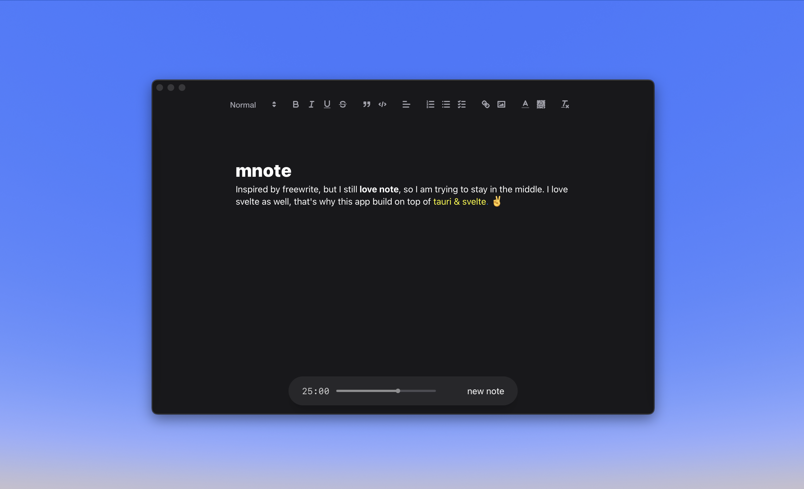

# Read Me

<div align="center">



A minimalist note-taking app built with Tauri and Svelte, inspired by Freewrite's distraction-free writing experience.

[](LICENSE)
[](https://tauri.app)
[](https://svelte.dev)

</div>

## ✨ Features

- **Focus Mode**: Distraction-free writing environment
- **Dark Mode**: Easy on the eyes for night writing
- **Custom Fonts**: Multiple font options including system, Lato, Nunito, Manrope, and more
- **Note History**: Keep track of your writing sessions
- **Cross-platform**: Built with Tauri, runs natively on macOS, Windows, and Linux
- **Markdown Support**: Support write in markdown, see it rendered beautifully

## 🚀 Current Progress

### Completed Features

#### Core Features
- ✅ Rich text editor with Markdown support
- ✅ Note history management
- ✅ Theme switching Light - Dark - Chocolate
- ✅ Custom Font selection
- ✅ Focus mode with Pomodoro like timer

#### Left Bar - Folder & History
- ✅ History sorting by creation date & updated date

### Under Development

#### Left Bar - Folder & History
- 🔄 Search functionality
- 🔄 Two-level nested folder structure

#### Right Bar - Options
- 🔄 Additional font customization
- 🔄 Custom line height settings
- 🔄 Lofi player?
- 🔄 Export options

## 🛠️ Tech Stack

- **Frontend**: Svelte + TypeScript
- **Backend**: Tauri (Rust)
- **Database**: SQLite
- **Styling**: TailwindCSS & Bits-UI
- **Editor**: Quill.js with Markdown support
```